# KØdo (Niamh Doyle MVP)

## What

Fullstack MVP project using React, React Router, Tailwind CSS, Daisy UI and Material Icons in the frontend and Express and MySQL in backend.

## Presentation deck

[Link to deck](https://drive.google.com/file/d/1qy2mz3wCinoqPoAeg17vlnhMZVn-DJ1Z/view?usp=sharing)

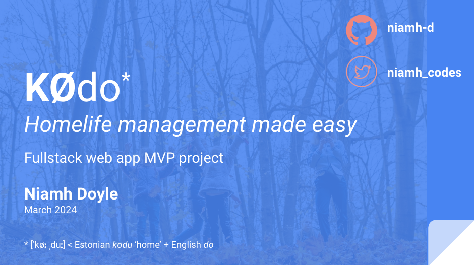

## Concept

KØdo (from Estonian kodu 'home' + English 'do') is pitched as a homelife management solution for busy parents, to facilitate caring for their children via the sharing of important information on the children in the family between guardians, be they primary guardians, extended family guardians (such as grandparents), or temporary guardians (e.g. neighbours, friends).

The idea is for it to be a convenient tool to allow for scheduling of family life and storing of key data points, such as contact information of the children's schools and doctors, child dietary requirements and likes, upcoming appointments and events etc.

## Running

Installation instructions are at the very end of this readme.

1. In the terminal run the below. Don't kill it; let it run.

```
npm start
```

2. In a fresh, second terminal run the below. Don't kill it; let it run.

```
cd client
npm run dev
```

3. In a third terminal run:

```
mysql -u root -p
<enter your mysql password>
USE kodo;
```

Or if you already have set up mysql so you skip entering password:

```
mysql
USE kodo;
```

4. In a fourth terminal run the below. Don't kill it; let it run. This listen for CSS changes in input.css and rebuilds output.css;

```
 npx tailwindcss -i src/index.css -o src/output.css --watch
```

Fin! You are done! Now get back to developing!

## Functionality

### Present functionality

- Sign up as a new user
- Create a family as an admin user
- Edit profile details
- Add children and invite other users guardians to your family
- Send, cancel and accept / decline invites
- Remove guardians
- View family's doctors and teachers (data comes only from backend starter data)

### Not presently-possible functionality (but possible to do)

- Provide other guardians access to only speciifc views
- Edit child details
- Add information on your child's school, teacher, doctor, diet, etc.
- Scheduling
- Sending reminders by SMS/email/WhatsApp

## Pages

### Homepage & login

Homepage as seen by logged-out visitors


Homepage as seen by logged-in users

;

Login screen

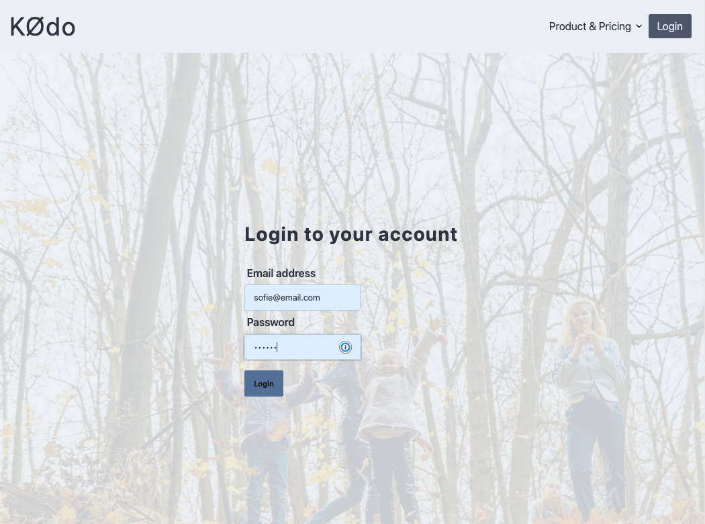;

Sign up

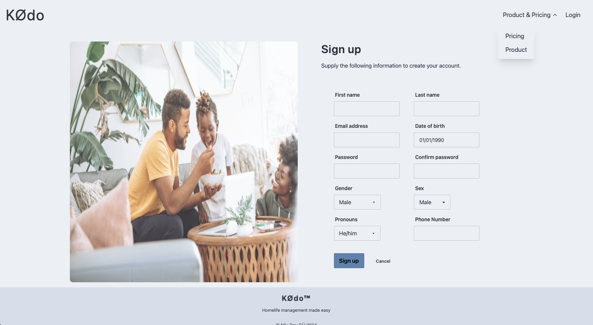;

### Inner App

The inner app, which a user gets access to upon successful sign in. Allows user to navigate to a number of views. Only the profile, admin, and family views have been built out so far.

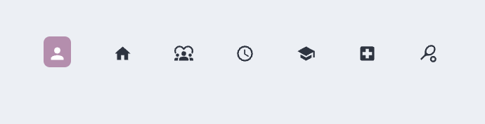

#### Profile

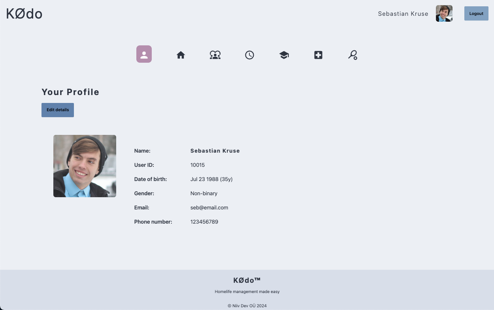

#### Admin view

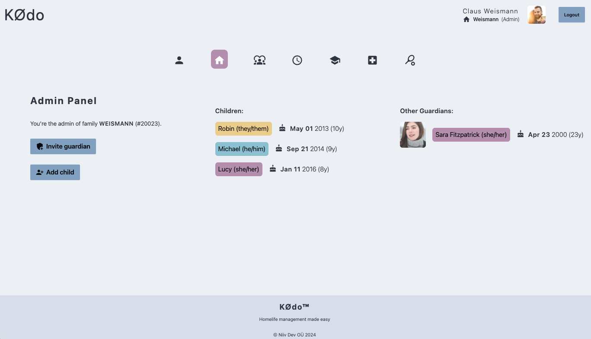

#### Family view

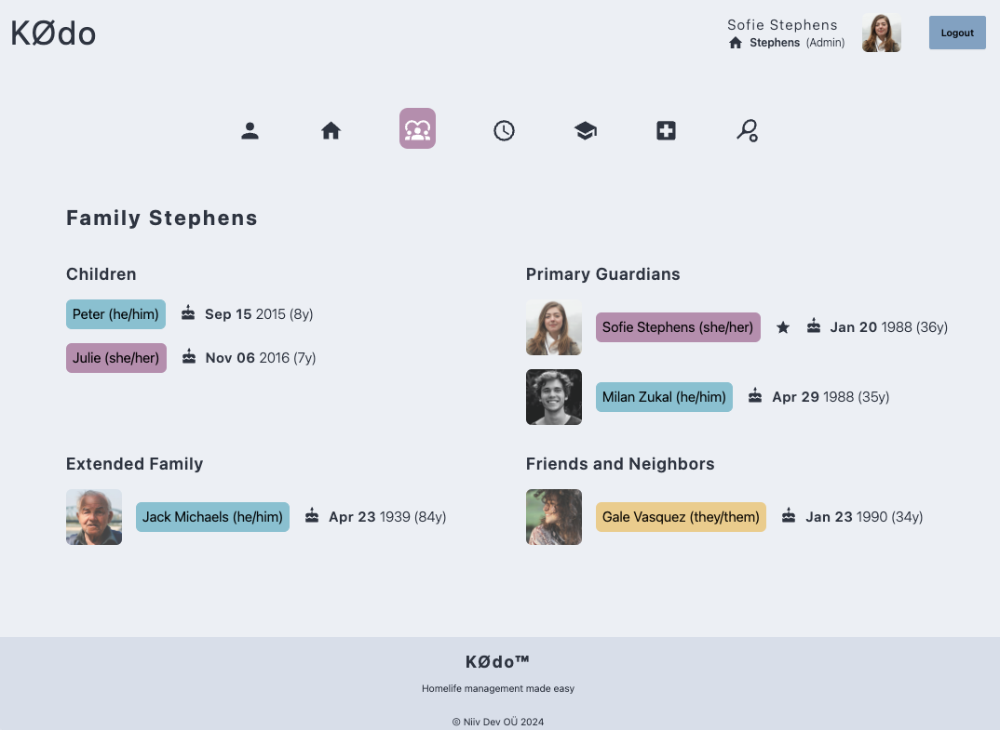

#### Schooling view

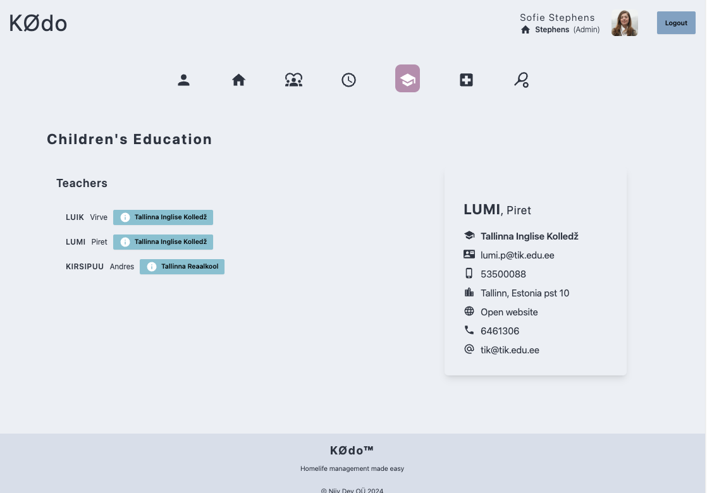

#### Health view

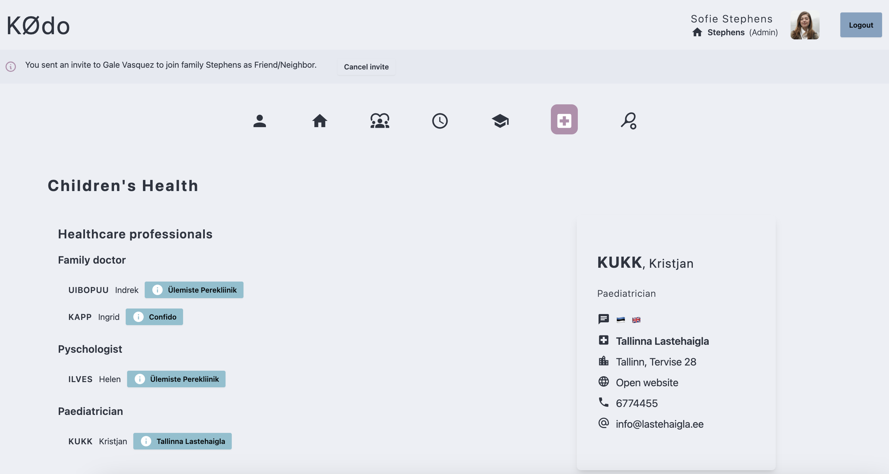

## Features

### Invites

Invite banner notification as seen from the invitor's side

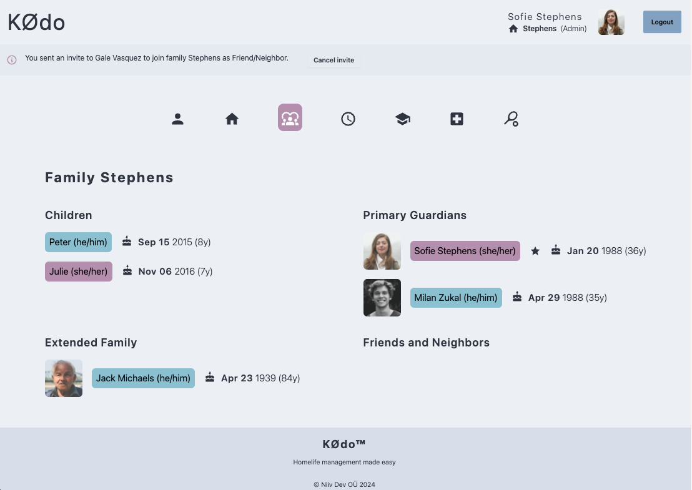

Invite banner notification as seen from the invitee's side

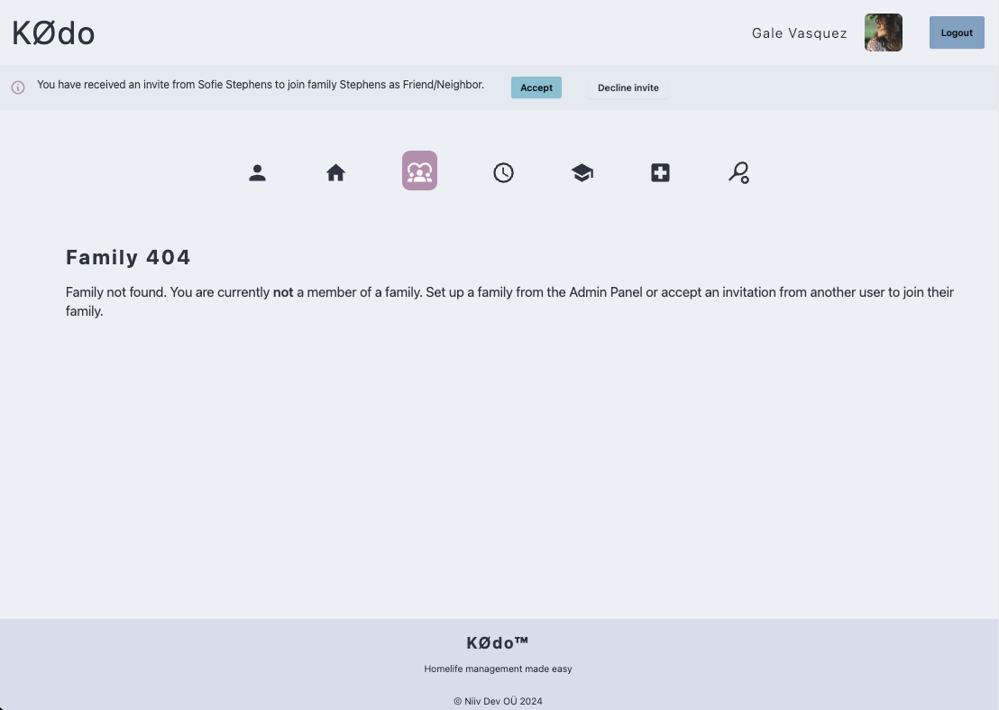

## Backend

### ERD

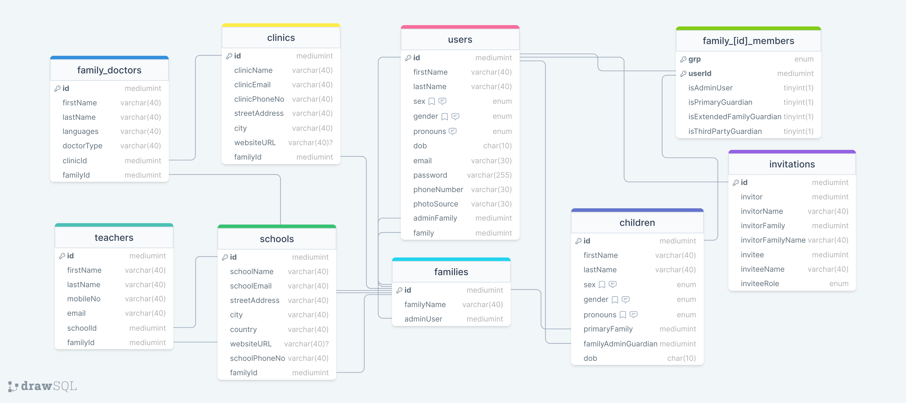

### Endpoints

7 endpoints – /users, /families, families/members, /children, /invitations, /health, /education

## Conceptualising

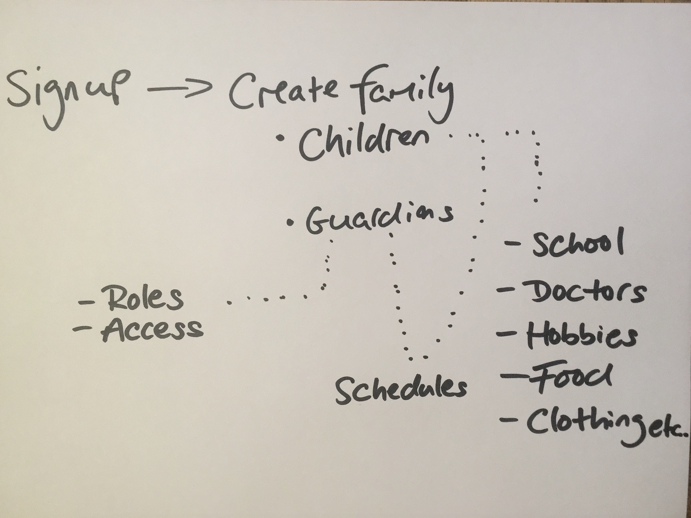


## Installation

## Setting up repository on machine

### Fork project to your GitHub account

1. Follow the guide [**here**](https://docs.github.com/en/pull-requests/collaborating-with-pull-requests/working-with-forks/fork-a-repo#forking-a-repository)

### Cloning project to your machine

2. Follow the guide [**here**](https://docs.github.com/en/pull-requests/collaborating-with-pull-requests/working-with-forks/fork-a-repo#cloning-your-forked-repository)

## Setting up project (just the first time)

### Open project in VSCode

1. Once the project is on your machine, drag the folder and drop it in VSCode to open it or run the [shortcut](https://www.freecodecamp.org/news/how-to-open-visual-studio-code-from-your-terminal/):

```
cd <path to project directory>
code .
```

### Add DOT env with your DB password

2. Create a .env file at the top level of your project with the following (all other details are already in the model/database.js file)

```
DB_PASS=<your password>
```

### Create DB

3. Open up the terminal in VSCode and run

```
mysql -u root -p
<enter your mysql password>
CREATE DATABASE kodo;
```

Or if you already have set up mysql so you skip entering password:

```
mysql
CREATE DATABASE kodo;
```

You can kill terminal.

## Installation steps (just the first time)

### Install backend packages and set up db tables and populate with initial data

1. In the terminal run:

```
npm i
npm run migrate
```

### Install frontend packages

2. In the same terminal run:

```
cd client
npm i
```

_This is a student project that was created at [CodeOp](http://codeop.tech), a full stack development bootcamp in Barcelona._
