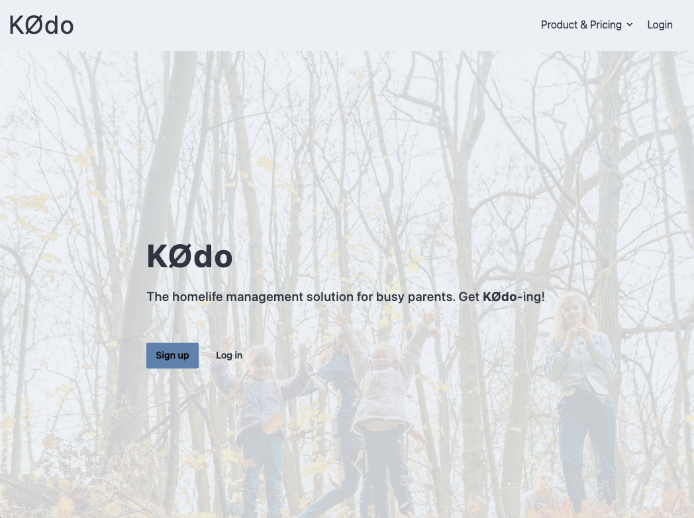
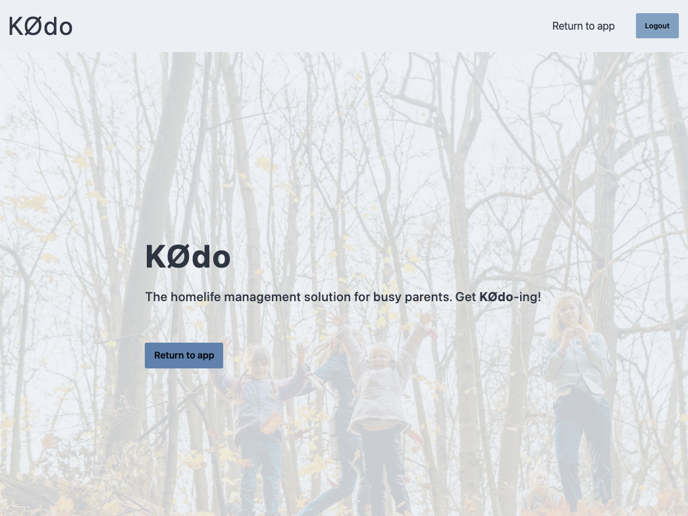

# KØdo (Niamh Doyle MVP)

## What

Fullstack MVP project using React, React Router and Tailwind CSS in frontend and Express and MySQL in backend.

## Concept

KØdo (from Estonian kodu 'home' + English 'do') is pitched as a homelife management solution for busy parents, to facilitate caring for their children via the sharing of important information on the children in the family between guardians, be they primary guardians, extended family guardians (such as grandparents), or temporary guardians (e.g. neighbours, friends).

The idea is for it to be a convenient tool to allow for scheduling of family life and storing of key data points, such as contact information of the children's schools and doctors, child dietary requirements and likes, upcoming appointments and events etc.

## Pages

### Homepage & login

Homepage as seen by logged-out visitors

Homepage as seen by logged-in users

;

### Homepage & login

_This is a student project that was created at [CodeOp](http://codeop.tech), a full stack development bootcamp in Barcelona._
